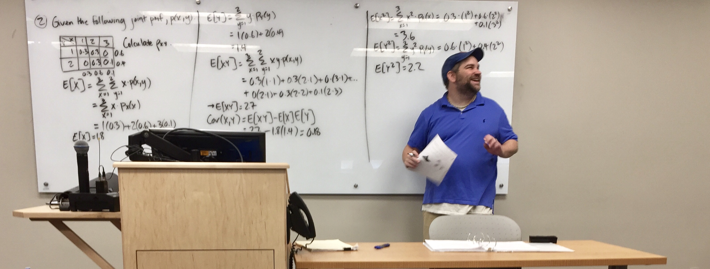

	  

This page includes my teaching philosophy and an empirical assessment of my teaching effectiveness. It also serves as a directory for the courses I have taught, which are freely available to current students, alumni of my classes, and any other interested observers. Transitions my website has made over the years---from university servers, to Wordpress, to (now) Github---have led to the loss of several old course websites in the shuffle. People interested in syllabi from previous courses I taught at Alabama and Illinois can e-mail me to obtain a past syllabus.

  



# Course Directory

# Colorado State University

#### Undergraduate Classes

- [POSC 1020](http://posc1020.svmiller.com) (Introduction to International Relations)
- [POSC 3410](/teaching/posc-3410-quantitative-methods-in-political-science/) (Quantitative Methods in Political Science)
- [POSC 3610](http://posc3610.svmiller.com) (International Conflict)
- [POSC 3630](/teaching/posc-3630-united-states-foreign-policy/) (United States Foreign Policy)

#### Graduate Classes

- [POST 8000](https://github.com/svmiller/post8000) (Foundations of Social Science Research for Public Policy)

